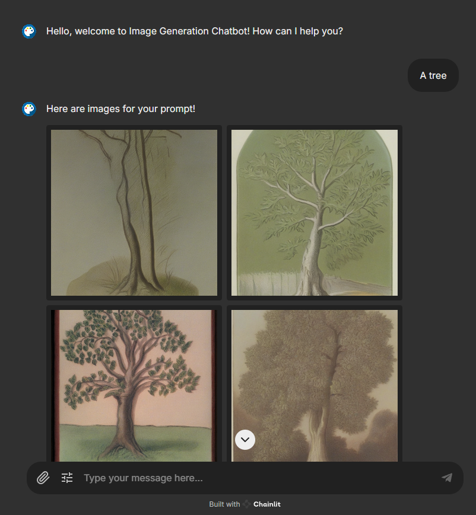
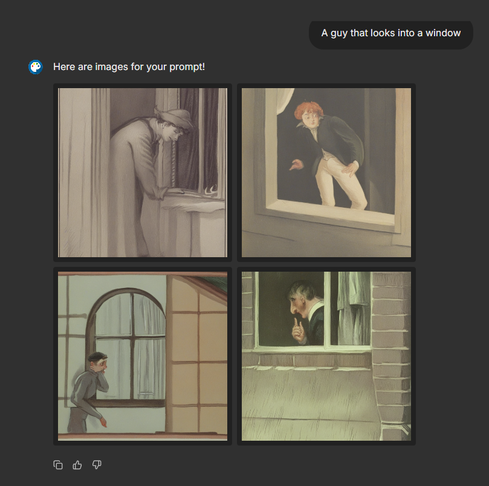

# Stable Diffusion Fine Tuned

Stable Diffusion Fine Tuned is an AI-powered image generation project that uses a fine-tuned stabilityai/stable-diffusion-xl-base-1.0 model on a custom dataset to generate images. The project aims to generate high-quality book-style images based on text descriptions, leveraging advanced parallelism techniques to efficiently process multiple images concurrently. This project is designed to run on cloud compute instances with high VRAM capacity, making it suitable for generating complex, high-resolution images.

## Key Features

- **Fine-Tuned Model:** Utilizes the stabilityai/stable-diffusion-xl-base-1.0 model fine-tuned on a custom dataset.
- **Custom Dataset:** Unique dataset that includes a variety of book-style images with detailed descriptions to enhance the model's ability to generate accurate and contextually relevant visuals.
- **Parallel Image Processing:** Implements asynchronous loading to concurrently process four images, optimizing the image generation process for speed and efficiency.
- **FastAPI Integration:** Utilizes FastAPI for building and deploying the application, ensuring a robust and scalable backend for image generation.
- **Chainlit Interface:** Runs in a Chainlit interface, providing a user-friendly and interactive experience for monitoring and managing the image generation process.

## Demo Thumbnails

Below are sample thumbnails of the generated images:

 

## Installation

1. Clone the repository.
2. Install the required dependencies from the `requirements.txt` file.
3. Set up a cloud compute instance with at least 24 GB VRAM (e.g., Runpod.io, AWS Sagemaker).

## Usage

1. Launch the cloud compute instance.
2. Run the notebook(that located in src folder) in cloud instance.
3. Add the ngrok port from the notebook to app_config.yml file.
4. Run chatbot.py file with this command: "chainlit run src/chatbot.py"

---

Stable Diffusion Fine Tuned is crafted to push the boundaries of image generation by fine-tuning a powerful model on a specialized dataset, enabling the creation of visually compelling book-style images with high accuracy and efficiency.
